# 🔐 SecureVault

### Secure File Protection & Security Auditing Platform

SecureVault is a desktop cybersecurity application built with **Python and Tkinter** that combines secure file encryption, authentication, multi-factor authentication, session protection, file-risk analysis, quarantine, tamper-evident auditing, security monitoring, and security reporting into a single application.

The project evolved from a basic file encryption utility into a broader defensive cybersecurity platform designed to demonstrate practical implementation of modern security concepts.

---

# 📸 Application Screenshots

The following screenshots demonstrate the major features and user interfaces available in SecureVault.

## 🔐 Login

Secure authentication entry point for accessing the SecureVault workspace.

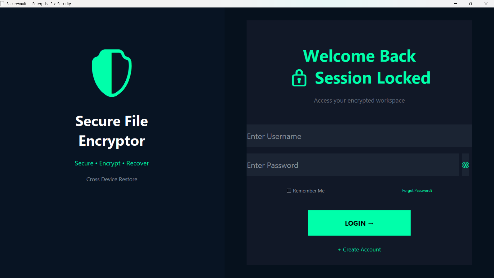

---

## 📊 Dashboard

The main dashboard provides an overview of the application, security status, activity, statistics, and available security tools.

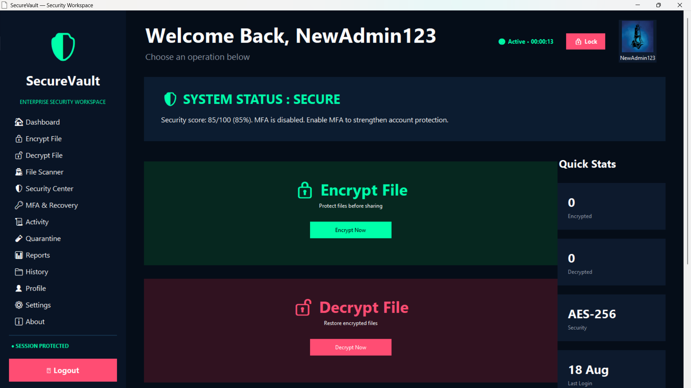

---

## 🛡️ Security Center

The Security Center provides a centralized view of the application's security posture, Security Score, security recommendations, and security-related alerts.

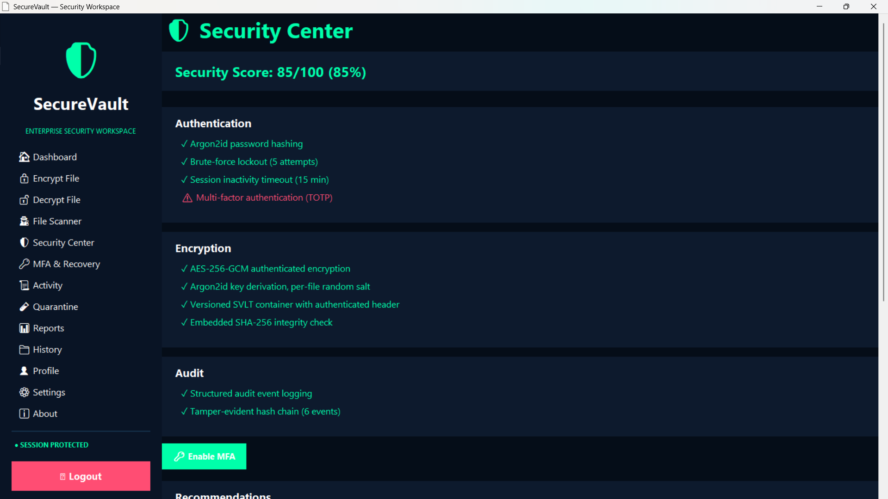

---

## 🔎 File Security Scanner

The File Security Analyzer examines files and provides an explainable risk assessment based on file characteristics, extensions, signatures, and suspicious patterns.

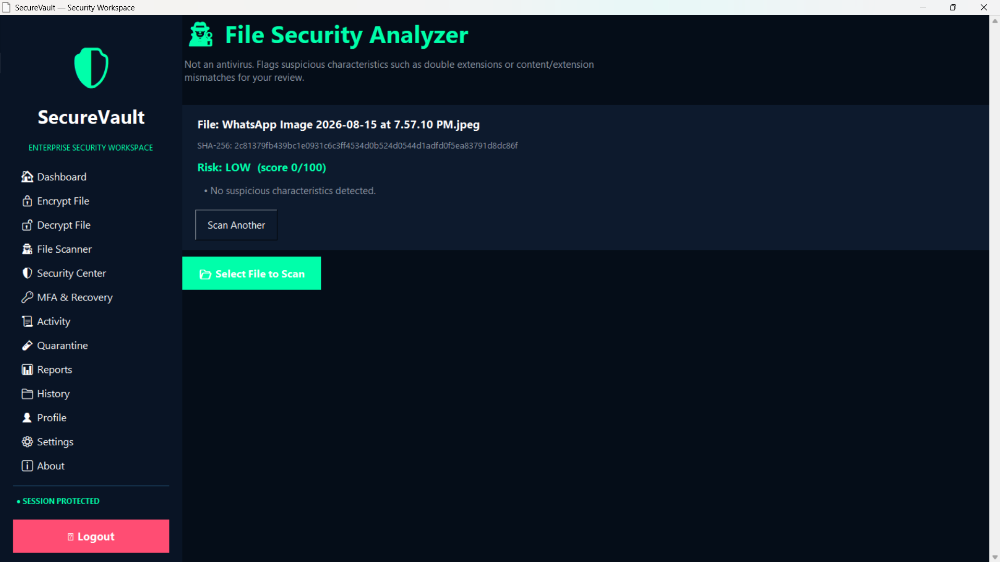

---

## 📦 Quarantine

Suspicious files can be isolated in quarantine for inspection, restoration, or permanent deletion.

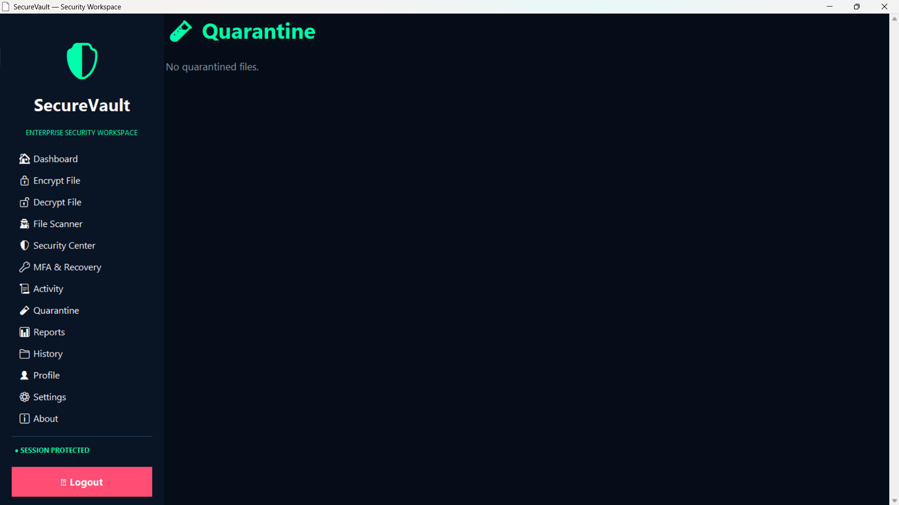

---

## 🔑 Multi-Factor Authentication

SecureVault supports TOTP-based multi-factor authentication and recovery codes.

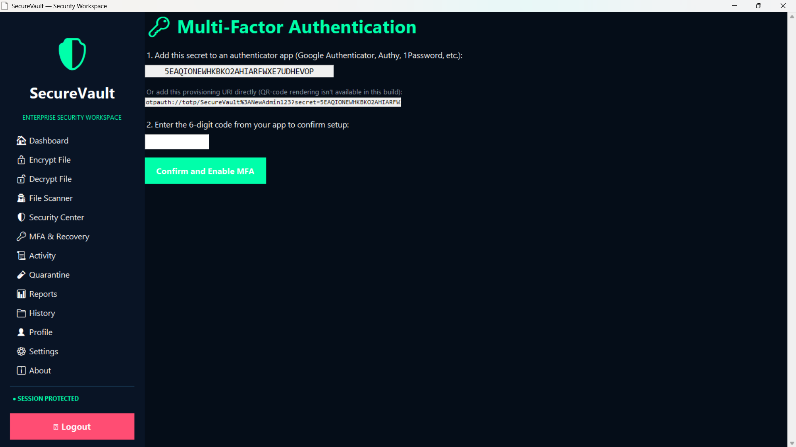

---

## 🧾 Activity Center

The Activity Center provides a security-focused history of important application operations.

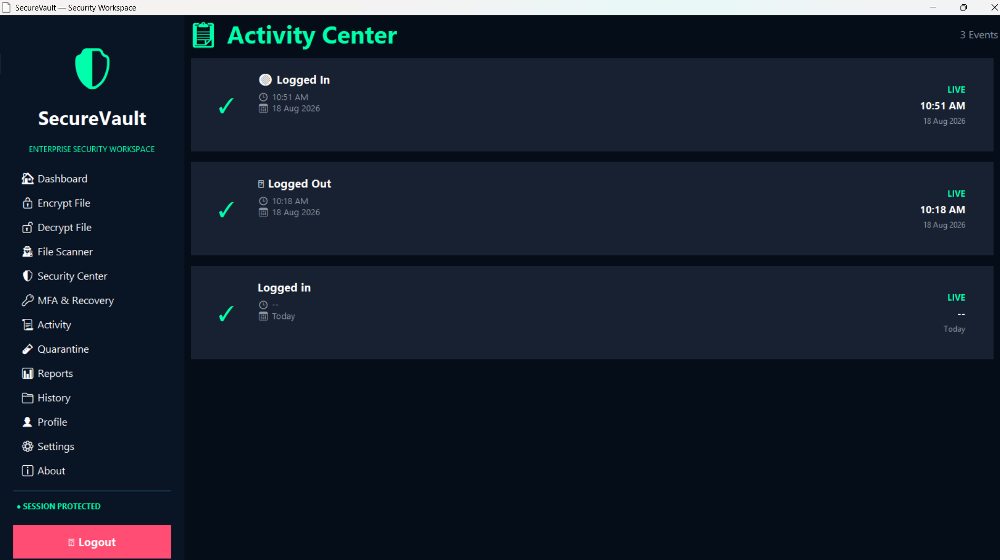

---

## 📄 Security Reports

Security reports can be generated from the application's security and audit information.

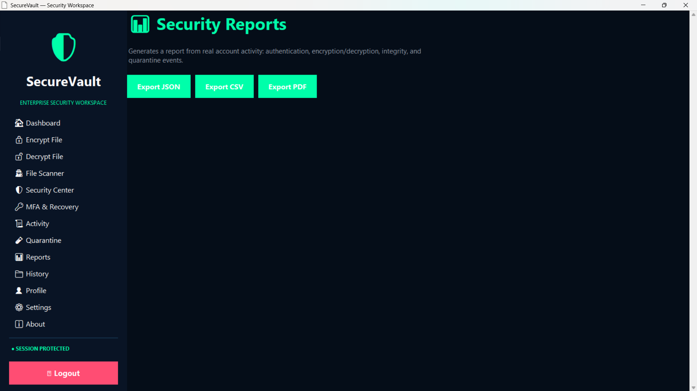

---

## 🔒 File Encryption

Files can be protected using the SecureVault encryption workflow.

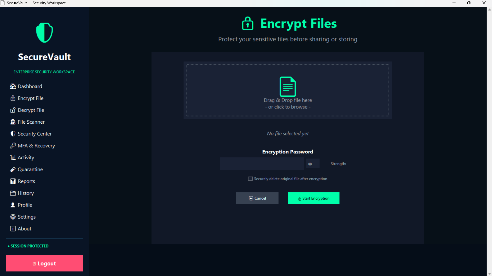

---

## 🔓 File Decryption

Encrypted files can be decrypted after successful authentication and integrity verification.

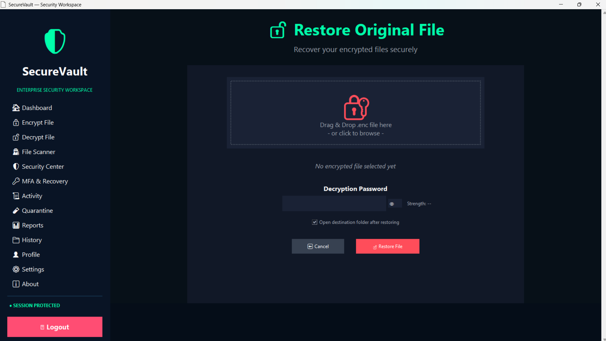

---

## 📁 File History

The File History interface provides information about previously processed files.


---

## 👤 User Profile

The profile interface allows users to manage account-related information and profile settings.

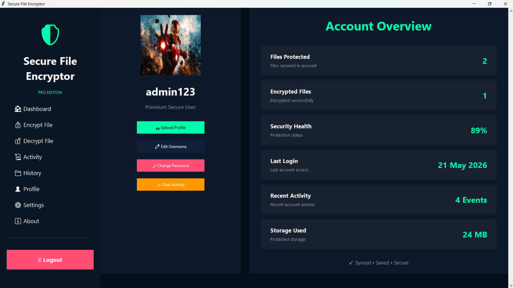

---

## ⚙️ Settings

Application preferences and security-related settings can be managed through the Settings interface.

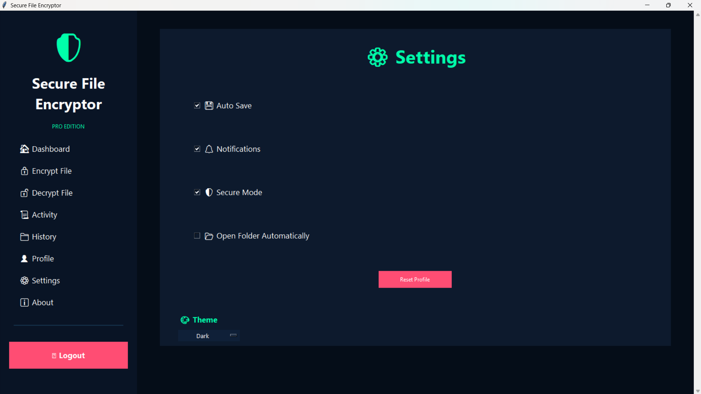

---

## ℹ️ About

The About section provides information about the SecureVault application.


---

# 🚀 Features

## 🔑 Secure Authentication

SecureVault provides a security-focused authentication system with:

- Argon2id password hashing
- SQLite-backed user management
- Generic authentication error messages
- Brute-force protection
- Failed-login tracking
- Temporary account lockout
- Password management
- Secure logout
- Session validation
- Session timeout
- Session locking and unlocking

Passwords are not stored as plaintext credentials.

---

# 🔐 Multi-Factor Authentication

SecureVault supports TOTP-based multi-factor authentication.

Features include:

- TOTP authentication
- Authenticator-app compatibility
- MFA enrollment
- MFA verification
- MFA enable/disable
- Recovery codes
- MFA security event logging

When MFA is enabled, successful password authentication alone is not sufficient to create an authenticated session.

---

# 🔒 Secure File Encryption

New files are protected using authenticated encryption.

The current encryption design uses:

- AES-256-GCM
- Argon2id key derivation
- Random per-file salt
- Random encryption nonce
- Authenticated metadata
- Versioned SVLT file format
- SHA-256 integrity verification

### Encryption Flow

```text
User Password
      │
      ▼
Argon2id Key Derivation
      │
      ▼
AES-256-GCM Encryption
      │
      ▼
Versioned SVLT Container
      │
      ▼
Encrypted File
```

SecureVault uses established cryptographic primitives rather than implementing custom cryptographic algorithms.

---

# 🔓 Secure Decryption

The decryption workflow verifies the encrypted file before recovering the original content.

```text
Encrypted SVLT File
        │
        ▼
Read Metadata
        │
        ▼
Derive Key
        │
        ▼
Authenticate Ciphertext
        │
        ▼
Integrity Verification
        │
        ▼
Recover Original File
```

Incorrect passwords or modified encrypted data are rejected.

---

# 🔄 Legacy File Compatibility

Earlier versions of the application used Fernet-based encryption.

SecureVault maintains compatibility with supported legacy encrypted files so that previously protected data is not unnecessarily abandoned.

Legacy files can be decrypted and migrated to the newer SVLT/AES-256-GCM format.

---

# 🧾 File Integrity Protection

SecureVault uses authenticated encryption and integrity checks to detect unauthorized modification of protected files.

If encrypted data or authenticated metadata is modified, the application rejects the file instead of silently returning corrupted content.

---

# 🔎 File Security Analyzer

SecureVault includes a deterministic file-risk analyzer designed for defensive security analysis.

The scanner evaluates characteristics such as:

- Filename
- Extension
- File signature
- Detected file type
- SHA-256 hash
- Double extensions
- Executable extensions
- Extension/content mismatches
- Disguised executable patterns

Example:

```text
invoice.pdf.exe
```

can be identified as suspicious because the filename attempts to appear like a document while ending in an executable extension.

> The analyzer is a deterministic defensive file-risk tool. It is not intended to replace antivirus, EDR, malware sandboxing, or professional malware-analysis systems.

---

# 📊 Risk Scoring

The scanner produces an explainable risk assessment.

Possible risk levels include:

```text
LOW
MEDIUM
HIGH
CRITICAL
```

Instead of providing only a score, SecureVault can provide reasons explaining why a file was considered suspicious.

---

# 📦 Quarantine

Suspicious or high-risk files can be moved into quarantine.

The quarantine workflow supports:

- Quarantine
- Inspect
- Restore
- Permanently delete
- Security event logging

Quarantine records can contain information such as:

- Original filename
- Original location
- File hash
- Risk level
- Detection reason
- Timestamp

---

# 🗑️ Secure Delete

SecureVault provides a secure-delete workflow that overwrites file contents before removing the file.

```text
File
 │
 ▼
Overwrite
 │
 ▼
Remove
 │
 ▼
Audit Event
```

The implementation is documented honestly and does not claim guaranteed physical destruction on every storage technology.

---

# 🛡️ Security Center

The Security Center provides a centralized security overview.

It brings together information from:

- Authentication
- MFA
- Sessions
- Encryption
- File security
- Quarantine
- Audit logging
- Security events

---

# 🎯 Security Score

SecureVault calculates a Security Score based on the current security state of the application.

The score can consider factors such as:

- Authentication protection
- MFA status
- Session security
- Encryption
- Audit integrity
- File security
- Security events

The score is calculated from application state rather than being a fixed hardcoded value.

Security recommendations can be generated based on the current security posture.

---

# 🚨 Security Alerts

SecureVault provides security alerts for important events.

Examples include:

- Repeated failed login attempts
- Account lockout
- MFA changes
- Integrity failures
- Suspicious files
- High-risk files
- Quarantine operations
- Audit verification failures

This provides users with a centralized view of important security conditions.

---

# 🧾 Tamper-Evident Audit Logging

Security-sensitive operations are recorded in a structured audit system.

Examples include:

- Successful login
- Failed login
- Account lockout
- Logout
- Session lock
- Session expiration
- MFA events
- File encryption
- File decryption
- Decryption failures
- Integrity failures
- File scanning
- Quarantine operations
- Secure deletion
- Report generation

Audit events are linked using a SHA-256 hash chain.

```text
Event 1
   │
   ▼
Hash 1
   │
   ▼
Event 2 + Previous Hash
   │
   ▼
Hash 2
   │
   ▼
Event 3 + Previous Hash
   │
   ▼
Hash 3
```

This makes modification, deletion, or reordering of historical events detectable.

The audit system is **tamper-evident**, not tamper-proof.

---

# 📈 Activity Monitoring

The Activity Center provides a security-focused timeline of application operations.

Examples include:

```text
LOGIN_SUCCESS
LOGIN_FAILED
MFA_SUCCESS
FILE_ENCRYPTED
FILE_DECRYPTED
FILE_SCANNED
HIGH_RISK_FILE_DETECTED
FILE_QUARANTINED
FILE_RESTORED
SECURITY_REPORT_GENERATED
```

This provides useful visibility into application activity.

---

# 📄 Security Reports

SecureVault supports security report generation in:

- PDF
- CSV
- JSON

Reports can contain information such as:

- Security Score
- Authentication activity
- MFA status
- Encryption activity
- File security information
- Quarantine activity
- Audit information
- Security recommendations

Sensitive information such as passwords, encryption keys, and recovery codes should never be included in reports.

---

# 🏗️ Architecture

SecureVault follows a layered architecture.

```text
┌───────────────────────────────┐
│          Tkinter UI           │
│ Login / Dashboard / Tools     │
└───────────────┬───────────────┘
                │
                ▼
┌───────────────────────────────┐
│           Services            │
│ Encryption / Reports /        │
│ Quarantine / Workflows        │
└───────────────┬───────────────┘
                │
                ▼
┌───────────────────────────────┐
│        Security Core          │
│ Crypto / KDF / Scanner /      │
│ File Format / Security Score  │
└───────────────┬───────────────┘
                │
          ┌─────┴─────┐
          ▼           ▼
┌───────────────┐ ┌───────────────┐
│    SQLite     │ │ Audit System  │
│ Users         │ │ Events        │
│ Sessions      │ │ Hash Chain    │
│ MFA           │ │ Verification  │
└───────────────┘ └───────────────┘
```

The goal of this architecture is to keep security-sensitive logic separate from the graphical user interface wherever practical.

---

# 📁 Project Structure

```text
SecureVault/
│
├── app.py
├── auth.py
├── dashboard.py
├── encrypt.py
├── decrypt.py
├── crypto_utils.py
│
├── auth_core/
│   ├── password.py
│   ├── user_service.py
│   ├── session.py
│   ├── migration.py
│   ├── mfa.py
│   └── mfa_service.py
│
├── core/
│   ├── crypto.py
│   ├── kdf.py
│   ├── file_format.py
│   ├── scanner.py
│   ├── secure_delete.py
│   └── security_center.py
│
├── audit/
│   ├── events.py
│   ├── logger.py
│   └── verifier.py
│
├── database/
│   ├── db.py
│   └── user_repository.py
│
├── services/
│   ├── quarantine_service.py
│   └── report_service.py
│
├── tests/
├── assets/
├── screenshots/
│
├── README.md
├── SECURITY.md
├── ARCHITECTURE.md
├── THREAT_MODEL.md
├── USER_GUIDE.md
├── DEVELOPER_GUIDE.md
├── CHANGELOG.md
├── requirements.txt
└── .gitignore
```

---

# 🗄️ Database

SQLite is used for security-critical application state.

This includes areas such as:

- Users
- Password hashes
- Sessions
- MFA information
- Audit events
- Security events
- Quarantine records

The application does not rely on plaintext JSON credentials for authentication.

---

# 🧪 Testing

SecureVault includes automated tests covering the security-critical components of the application.

Testing includes:

### Authentication

- Registration
- Password hashing
- Login
- Invalid credentials
- User migration

### Brute-Force Protection

- Failed attempts
- Lockout threshold
- Lockout behavior
- Attempt reset

### Sessions

- Session creation
- Session validation
- Timeout
- Lock
- Unlock
- Logout

### MFA

- TOTP validation
- Invalid OTP handling
- Recovery codes
- MFA enforcement

### Encryption

- AES-GCM encryption
- AES-GCM decryption
- Wrong-password rejection
- Integrity verification
- Ciphertext tampering
- Header tampering
- Legacy file compatibility

### Audit

- Event creation
- Hash chaining
- Modified-event detection
- Deleted-event detection
- Reordered-event detection

### File Security

- File analysis
- Risk scoring
- Suspicious extensions
- Disguised executable detection

### Quarantine

- Quarantine
- Restore
- Inspect
- Delete

### Reports

- PDF
- CSV
- JSON

Run the complete test suite:

```powershell
python -m unittest discover -s tests -v
```

---

# 💻 Installation

## Windows

Open PowerShell inside the project directory.

Create a virtual environment:

```powershell
python -m venv venv
```

Activate it:

```powershell
venv\Scripts\activate
```

Upgrade pip:

```powershell
python -m pip install --upgrade pip
```

Install dependencies:

```powershell
pip install -r requirements.txt
```

Run the tests:

```powershell
python -m unittest discover -s tests -v
```

Start SecureVault:

```powershell
python app.py
```

---

## Linux / macOS

```bash
python3 -m venv venv
source venv/bin/activate
python3 -m pip install --upgrade pip
pip install -r requirements.txt
python -m unittest discover -s tests -v
python app.py
```

---

# 🚀 Quick Start

After launching SecureVault:

1. Create an account.
2. Log in.
3. Enable MFA if required.
4. Open Security Center.
5. Review the Security Score.
6. Encrypt a test file.
7. Decrypt the file.
8. Scan a test file.
9. Review its risk assessment.
10. Test quarantine.
11. Review Activity/Audit.
12. Verify audit integrity.
13. Generate a security report.
14. Lock and unlock the session.
15. Logout.

---

# 🔄 Application Workflow

```text
Create Account
      │
      ▼
Authentication
      │
      ▼
MFA Verification
      │
      ▼
Secure Session
      │
      ▼
Dashboard
      │
      ├───────────────┐
      ▼               ▼
 Encryption      File Scanner
      │               │
      ▼               ▼
 Decryption       Quarantine
      │               │
      └───────┬───────┘
              ▼
       Security Center
              │
       ┌──────┴──────┐
       ▼             ▼
 Security Score   Alerts
       │             │
       └──────┬──────┘
              ▼
        Audit / Activity
              │
              ▼
           Reports
```

---

# 🔐 Security Design

SecureVault follows several important security principles:

- Passwords are not stored in plaintext.
- Argon2id is used for password hashing and key derivation.
- Authenticated encryption is used for new encrypted files.
- Encryption uses random per-file cryptographic parameters.
- Authentication and file-encryption KDF contexts are separated.
- Repeated login failures are controlled.
- Sessions are enforced rather than represented only by UI state.
- Security-sensitive operations are audited.
- Audit tampering is detectable.
- File-risk decisions provide explainable reasons.
- Security failures should fail safely.
- Security limitations are documented rather than hidden.

---

# ⚠️ Security Limitations

SecureVault is a defensive cybersecurity project and is not intended to replace enterprise security products.

### File Scanner

The scanner is a deterministic risk-analysis tool and is not a complete antivirus or EDR engine.

It does not provide:

- Full malware detection
- Behavioral analysis
- Sandboxing
- Threat intelligence
- Real-time endpoint monitoring

### Large Files

The current encryption workflow loads file contents into memory and is therefore not optimized for extremely large files.

### Secure Delete

Overwrite-based deletion cannot guarantee destruction on all storage technologies.

For example:

- SSD wear-leveling
- Copy-on-write filesystems
- Snapshots
- Backups
- Cloud synchronization

may preserve copies beyond the application's control.

### Audit Chain

The audit chain is tamper-evident rather than tamper-proof.

An attacker with complete write access to the underlying database could theoretically rewrite the entire chain consistently.

### MFA

TOTP requires the application to retain the secret required to validate future authentication codes.

See `SECURITY.md` and `THREAT_MODEL.md` for the complete security discussion.

---

# 🧰 Technology Stack

| Technology | Purpose |
|---|---|
| Python | Application development |
| Tkinter | Desktop GUI |
| SQLite | Persistent security data |
| Argon2id | Password hashing / KDF |
| AES-256-GCM | File encryption |
| SHA-256 | Integrity and audit hash chain |
| TOTP | Multi-factor authentication |
| cryptography | Cryptographic primitives |
| unittest | Automated testing |
| PDF / CSV / JSON | Security reporting |

---

# 📚 Documentation

Additional project documentation:

- `SECURITY.md` — Security controls and limitations
- `ARCHITECTURE.md` — Technical architecture
- `THREAT_MODEL.md` — Threat model
- `USER_GUIDE.md` — User instructions
- `DEVELOPER_GUIDE.md` — Development guide
- `CHANGELOG.md` — Version history

---

# 🗺️ Future Roadmap

Potential future improvements include:

- QR-code MFA provisioning
- Hardware security key support
- OS-backed MFA secret storage
- Chunked/streaming encryption for very large files
- Signed audit checkpoints
- External audit-chain anchoring
- Advanced file analysis
- Threat-intelligence integration
- Advanced security-event correlation
- Additional endpoint security capabilities

---

# 🎓 Learning Outcomes

SecureVault provided practical experience with:

### Cybersecurity

- Application security
- Authentication
- Session management
- MFA
- Defensive file security
- Security monitoring
- Security auditing

### Cryptography

- AES-GCM
- Argon2id
- Key derivation
- Salts
- Nonces
- Integrity verification
- Versioned encryption formats

### Software Engineering

- Python
- Tkinter
- SQLite
- Modular architecture
- Service-oriented design
- Unit testing
- Integration testing
- Error handling
- Documentation

### Security Engineering

- Threat modeling
- Security controls
- Attack-surface reduction
- Tamper detection
- Secure failure handling
- Security testing

---

# 📈 Project Evolution

SecureVault evolved through several stages.

### Initial Version

- Basic login
- File encryption
- File decryption
- Dashboard
- JSON-based persistence

### Security Modernization

- SQLite authentication
- Argon2id password hashing
- AES-256-GCM encryption
- SVLT file format
- Session security
- Brute-force protection
- MFA
- Tamper-evident audit logging

### Defensive Security Expansion

- File scanner
- Risk scoring
- Quarantine
- Secure delete
- Security Center
- Security Score
- Security Alerts
- Security reports

### Current Release

- Improved application architecture
- Security-focused dashboard
- Improved UI reliability
- Expanded automated testing
- Security documentation
- Portfolio-ready GitHub repository

---

# 📌 Project Status

**SecureVault v4.0**

**Status: Stable**

The current release includes:

- Secure authentication
- Argon2id password hashing
- TOTP MFA
- Brute-force protection
- Session security
- AES-256-GCM encryption
- Versioned SVLT format
- Legacy compatibility
- File integrity protection
- File-risk analysis
- Risk scoring
- Quarantine
- Secure delete
- Tamper-evident audit logging
- Audit verification
- Security Center
- Security Score
- Security Alerts
- Activity monitoring
- PDF/CSV/JSON reporting
- Automated security testing

---

# 👨‍💻 Author

**Koushik Amarendra**

B.Tech — Computer Science & Engineering
Cybersecurity

SecureVault was developed as a practical cybersecurity engineering project focused on defensive security, cryptography, secure authentication, file protection, auditing, and security monitoring.

---

# ⭐ Summary

SecureVault combines multiple defensive security controls into one desktop cybersecurity platform:

```text
Authentication
       +
Argon2id
       +
MFA
       +
Session Security
       +
AES-256-GCM
       +
File Integrity
       +
File Risk Analysis
       +
Quarantine
       +
Secure Delete
       +
Audit Logging
       +
Tamper Detection
       +
Security Center
       +
Security Alerts
       +
Security Reports
       +
Automated Testing
       │
       ▼
   SECUREVAULT
```

The project demonstrates how authentication, cryptography, file security, auditing, monitoring, and secure software engineering principles can be combined into a practical cybersecurity application.
